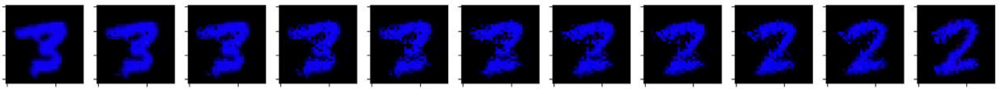
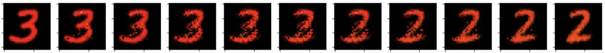
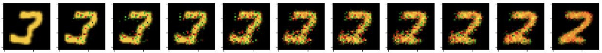
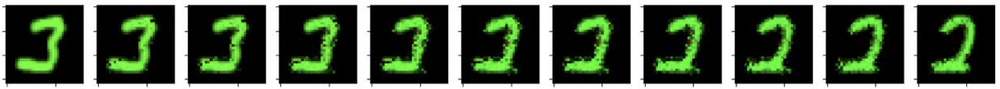

# Categorical Iterative Proportional Fitting
This is repository for SMILES summer school project on "Categorical Iterative Proportional Fitting". 

Visualization of learned process by C-IPF algorithm

